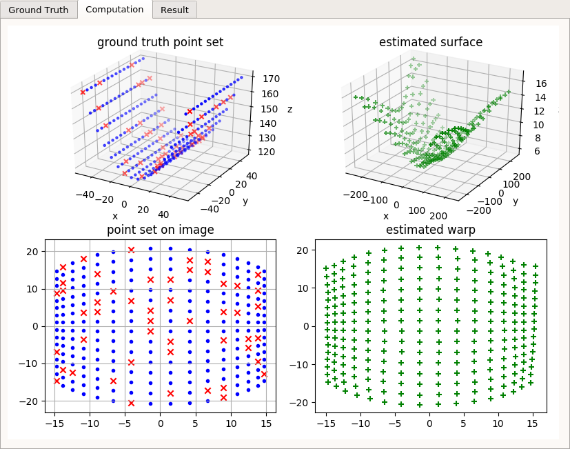

# shape-from-template

> ILE5014 計算機圖學期末專題

**table of content**

<!-- @import "[TOC]" {cmd="toc" depthFrom=2 depthTo=6 orderedList=true} -->
<!-- code_chunk_output -->

1. [Motivation](#motivation)
2. [Related Work](#related-work)
3. [Method](#method)
    1. [geometric modeling](#geometric-modeling)
    2. [problem reformulation](#problem-reformulation)
    3. [fromulation with the embedding](#fromulation-with-the-embedding)
    4. [formuation with the depth function](#formuation-with-the-depth-function)
    5. [chance](#chance)
    6. [solution](#solution)
4. [Implementation](#implementation)
    1. [template embedding $\Delta$](#template-embedding-delta)
    2. [warp $\eta$](#warp-eta)
    3. [data simulation](#data-simulation)
    4. [coding](#coding)
5. [Result](#result)
6. [Appendix A. Problem on reconstructing warp function](#appendix-a-problem-on-reconstructing-warp-function)

<!-- /code_chunk_output -->

## Motivation

自身論文的目標中有個子問題為基於已完成registration的keypoint嘗試重建3D表面，由於此部份命題非論文之重點，規劃以實做既有論文處理之，並以實作此方法作為本課程期末專題。

## Related Work

我們希望在已知物件外觀與拍攝RGB照片的情況下可以重建物件的3D表面，此問題在早期有structure from motion等技術，即透過大量多角度的照片去計算出原物體之3D外觀。而近期則有Salzmann(2009)等人發表在已知物件為convex下得以重建3D表面之技術，爾後由Brunet(2010)等發展出基於點雲的計算方式，加強了在如布料等可拉伸材料上重建的強健性，而本次欲實做之論文為2015年Bartoli等人發表在*PAMI*上的方法，其探討不同的物體表面提供不同的解法，達到更好的容錯能力。

## Method

本專題實做Bartoli之方法：

```tex
@article{bartoli2015shape,
  title={Shape-from-template},
  author={Bartoli, Adrien and G{\'e}rard, Yan and Chadebecq, Fran{\c{c}}ois and Collins, Toby and Pizarro, Daniel},
  journal={IEEE transactions on pattern analysis and machine intelligence},
  volume={37},
  number={10},
  pages={2099--2118},
  year={2015},
  publisher={IEEE}
}
```

以下簡述其概念，詳細數學推導見原論文。承原文之符號定義以下段落中以：

+ *希臘字母* 表函式
+ $J_\alpha$ 表函式$\alpha$之一階微分

### geometric modeling

下圖取自Bartoli(2015)


作為原始輸入，我們有拍攝的照片$\mathcal{I}$以及已知的參數化表面$\mathcal{P}$。而此方法中我們尚需要知道物件的3D外觀$\mathcal{T}$，始得求取本命題之目標$\mathcal{S}$。

這幾組表面之關係如上圖，其中會有幾組我們已知的關係矩陣，包括$\mathcal{P}$與$\mathcal{T}$間的關係$\Delta$與$\Delta^{-1}$，承前段落所述，本實作以不變形的物件為主，故可假定為identity matrix。另外基於perspective projection可取得$\Pi$、以及基於已知對應點建立之warp function $\eta$。

因此初始命題可設定為

$$
\begin{align}
\text{find } & \Psi \in \mathcal{T} \\
\text{s.t.} & \left\{ \begin{array}{l}
    \Pi \circ \Psi \circ \Delta = \eta \\
    J^{\top}_{\Psi,\mathcal{T}} J_{\Psi,\mathcal{T}} = I
\end{array} \right.
\end{align}
$$

其中$J_{\Psi,\mathcal{T}}$表$\Psi$在$\mathcal{T}$之tangent space之微分形式。本命題之第一式為前段落設定之各函數間之投影關係，而第二式來自於表面上各店即使在各類deformation下其切空間之關係不變。

### problem reformulation

由於直接解決解出整個變形函式十分困難，因此將問題修改為解出其深度函式。設對於點$p\in\mathcal{P}$存在函式$\gamma$可得其深度

$$
\gamma \in \mathbb{R}
$$

且此深度函式僅為實數域，可有助於後續解題

### fromulation with the embedding

在初始設定時可知

$$
\Psi = \varphi \circ \Delta^{-1}
$$

將上式微分可得

$$
J_\Psi = (J_\Psi \circ \Delta) J_\Delta
$$

則
$$
\begin{align}
J^\top_\Psi J_\Psi
&=
J^\top_\Delta (J_\Psi \circ \Delta)^\top
(J_\Psi \circ \Delta) J_\Delta
\\ &= (\beta \circ \Delta) J^\top_\Delta J_\Delta
\\ &= \nu J^\top_\Delta J_\Delta
\end{align}
\\ \text{with } \beta = J^\top_\Psi J_\Psi \in \mathbb{R}^+,
\nu = \beta \circ \Delta \in \mathbb{R}^+
$$

至此，命題可修正為

$$
\begin{align}
\text{find} & \left\{ \begin{array}{l}
    \varphi \in \mathcal{P} \\
    \nu \in \mathcal{P}
\end{array} \right. \\
\text{s.t.} & \left\{ \begin{array}{l}
    \Pi \circ \varphi = \eta \\
    J^\top_\varphi J_\varphi = \nu J^\top_\Delta J_\Delta
\end{array} \right.
\end{align}
$$

### formuation with the depth function

承前述，我們設定了一深度函式$\gamma$存在，因此可將投影函式修改為

$$
\varphi = \gamma \tilde \eta
$$

其中$\tilde \eta = \begin{bmatrix} \eta \\ 1 \end{bmatrix}$。將上式微分代入上方命題中的二式

$$
J_\varphi = \tilde \eta J_\gamma + \gamma J_{\tilde \eta} \\
\left\lVert \tilde \eta \right\rVert_2^2 J_\gamma^\top J_\gamma +
\gamma^2 J_\eta^\top J_\eta +
\gamma \left(
    J^\top_\gamma \eta^\top J_\eta +
    J_\eta^\top \eta J_\gamma
\right) =
\nu J^\top_\Delta J_\Delta
$$

至此可將命題整理為

$$
\begin{align}
\text{find} & \left\{ \begin{array}{l}
    \gamma \in \mathcal{P} \\
    \nu \in \mathcal{P}
\end{array} \right. \\
\text{s.t.} & \left\lVert \tilde \eta \right\rVert_2^2 J_\gamma^\top J_\gamma +
\gamma^2 J_\eta^\top J_\eta +
\gamma \left(
    J^\top_\gamma \eta^\top J_\eta +
    J_\eta^\top \eta J_\gamma
\right) =
\nu J^\top_\Delta J_\Delta
\end{align}
$$

### chance

設

$$
\varepsilon \equiv \left\lVert \tilde \eta \right\rVert_2 \\
\theta \equiv \gamma \epsilon \\
\xi \equiv \frac{1}{\epsilon^2} \left(
    J^\top_\eta
    J_\eta
    -
    \frac{1}{\varepsilon^2}
    J^\top_\eta
    \eta
    \eta ^\top
    J_\eta
\right)
$$

可將命題簡化為下述形式

$$
\begin{align}
\text{find} & \left\{ \begin{array}{l}
    \theta \in \mathcal{P} \\
    \nu \in \mathcal{P}
\end{array} \right. \\
\text{s.t.} & J^\top_\theta J_\theta + \xi \theta^2 =
\nu J^\top_\Delta J_\Delta
\end{align}
$$

### solution

上方形式之命題可解得

$$
\varphi = \sqrt{ \lambda_2 \left(
    J^\top_\Delta J_\Delta \left(
        J^\top_\eta
        J_\eta
        -
        \frac{1}{\left\lVert \tilde \eta \right\rVert_2^2}
        J^\top_\eta
        \eta
        \eta ^\top
        J_\eta
    \right) ^{-1}
\right)}
\tilde \eta
$$

$\lambda$中之計算會得到一$\mathbb{R}^{2\times2}$之矩陣，而$\lambda_2$為取矩陣eigenvalue中較小者。上式解法對於各點$p \in \mathcal{P}$可獨立計算，故此演算法可平行化處理。至此，已經可得isometric deformation下之解法。

## Implementation

### template embedding $\Delta$

由於設定上是以紙張為出發點，故此映射函數直接設定為

$$
\Delta(p) = \begin{bmatrix} p \\ 1 \end{bmatrix}
$$

因此也得到恆定的一階微分量

$$
J_\Delta(P) = \begin{bmatrix}
    1 & 0 \\
    0 & 1 \\
    0 & 0
\end{bmatrix}
$$

### warp $\eta$

在推導過程中都設定函式$\eta$存在，然實際上我們不可能取得完全連續的$\eta$，僅能由關鍵點對應並估計。參照原文2.4節建議使用thin-plate spline進行內差來當作$\eta$。

而原始計畫書中預期用SURF[^surf]進行keypoint registration，但實際執行時發現問題（參考Appendix A），故改採模擬資料之方式進行。

另外，spline function在投影點的時候會計算該點與附近數組控制點間之距離，而keypoint時常過於接近，導致計算出的相對座標十分不合理，本實做中的TPS函式會先合併輸入之控制點在計算其參數。

[^surf]: Bay, H., Tuytelaars, T., & Van Gool, L. (2006). Surf: Speeded up robust features. Computer vision–ECCV 2006, 404-417.

### data simulation

本計畫中預期實做isometric deform形式，故點與點間之距離在扭轉後不得改變，但對於一次以上的曲線要計算指定線段長度對應的x變化量十分複雜，故本實做中採取先模擬出曲面、再計算其投影與參數表面上的座標並進行計算。

細節如下：

1. 本實做模擬二次/三次曲面

    $$
    z_\mathcal{S} = a x_\mathcal{S}^b + c \\
    b \in \{ 2, 3 \}
    $$

2. 利用設定之焦距將其投影到2D空間，作為image space之採樣

    $$
    \mathcal{I}(Q) = \begin{bmatrix}
        f & 0 & 0 \\
        0 & f & 0 \\
        0 & 0 & 1
    \end{bmatrix} Q
    $$

3. 求曲線上線段長，還原正確的參數表面座標

    $$
    x_\mathcal{P} = \int \sqrt{ 1 + {f'_\mathcal{S}}^2 } dx
    $$

    對於二次式

    $$
    f'_\mathcal{S} = 2ax \\
    x_\mathcal{P} = \frac{1}{4a} \left(
        2nx \sqrt{ 4a^2x^2 +1 } + \sinh^{-1}(2ax)
    \right)
    $$

    對於三次式

    $$
    f'_\mathcal{S} = 3ax^2 \\
    x_\mathcal{P} = \frac{
        27a^3x^5 - 2\sqrt{3} \sqrt{ia} \sqrt{9a^2x^4+1}
        F( i \sinh^{-1}(\sqrt{3} \sqrt{ia} x \vert -1) ) +
        3ax
    }{9a\sqrt{9a^2x^4+1}} \\
    $$

    其中$F(x \vert m)$為第一類不完全橢圓積分，即

    $$
    F(\phi \vert m) = \int_0^\phi \frac{1}{ \sqrt{
        1 - m \sin^2(\theta)
    }} d\theta
    $$

取得參數表面之座標後，隨機取n個點計算出其template embedding與warp；並以前面章節導出之演算法估算表面外觀。

### coding

本實做使用python，數值計算主要採用[numpy]；由於該函式庫並沒有保證thread-safe，故對於最後可平行化計算之段落並沒有進行平行處理。

demo所用之圖形界面採用[Qt]，顯示界面分別為OpenGL與[matplotlib]。

[numpy]: http://www.numpy.org/
[Qt]: https://www.qt.io/
[matplotlib]: https://matplotlib.org/

注意numpy的線性代數計算可能會使用其他的函式庫，會影響計算成效；實做時已經注意到此程式在個人的實驗室桌機上可順利運行（底層使用[OpenBlas]），然而在個人的mac上則很容易找不到eigenvalue（無其他函式庫使用numpy內建實做）。

[OpenBlas]: https://github.com/xianyi/OpenBLAS

## Result

提交之程式碼中分`sft`與`demo`兩個模組；前者用於計算，後者純粹展示結果。

```sh
python -m demo
```

呼叫demo程式可得以下界面


左側界面可以調整模擬表面之外觀、樣本點數量與顯示品質；右側則對應生成之物件（$\mathcal{S}$），經計算過程取得之資訊（$Q, \mathcal{I}, \hat{\mathcal{I}}, \hat{\mathcal{S}}$）與計算出之表面的3D外觀（利用thin-plate sline合成出的$\hat{\mathcal{S}}$），界面中兩組GL視窗支援用滑鼠拖曳視角。


以預設之參數生成外觀



並進行計算

+ 左上圖：生成之點雲，紅色為實際餵入演算法的點集合，藍色僅為供顯示/識別
+ 左下圖：生成之圖片空間（$\mathcal{I}$）外觀
+ 右下圖：基於紅點生成出的warp
+ 右上圖：基於該warp生成出的曲面外觀


並繪製出計算出之曲面的3D外觀。

相較於函式庫畫出的點雲，3D外觀較易於去注意到雖然在多組參數之測試中該演算法皆可取得相當相似之外型，但實際上深度較淺，此部份需要實做原文中其他的修正項目。

## Appendix A. Problem on reconstructing warp function

這邊以《Open GL编程指南(原书第7版)》一書為追蹤目標，在取得其封面圖片與實際照片並經過適當的縮放後可得


而這兩張圖的keypoint registration分佈如下


其keypoint registration如下，注意以下配對已經使用L2 distance做過初步篩選


至此可見雖然多數的點都是正常的，但略可發現有少數老鼠屎，因此又利用了Famouri[^Famouri]的方法希望能篩掉部份的點


但可見沒什麼成效，大多數的點仍通過檢測。而這樣的配對結果在於使用TPS時則會因為spline function本身的性質，導致無法取得一個正確的表面：


上圖左側為原圖上的座標，右側為TPS輸出之結果；`+`號紀錄控制點座標（已合併過於接近的控制點），`.`則是均勻選擇的原圖上的座標，供視覺上檢視成果用。

除了SURF以外，亦嘗試過使用ORB[^orb]，但仍無法解決問題。由於無法解決warp mapping的問題，提交的程式碼已移除這個段落，如需要檢視，可在[github]上取得。

[^Famouri]: Famouri, M., Bartoli, A., & Azimifar, Z. (2017). Fast Shape-from-Template Using Local Features. Machine Vision and Applications, 1--21. https://doi.org/10.1007/s00138-017-0876-9
[^orb]: Rublee, E., Rabaud, V., Konolige, K., & Bradski, G. (2011, November). ORB: An efficient alternative to SIFT or SURF. In Computer Vision (ICCV), 2011 IEEE international conference on (pp. 2564-2571). IEEE.

[github]: https://github.com/tzing/IsoPSfT/tree/extra
